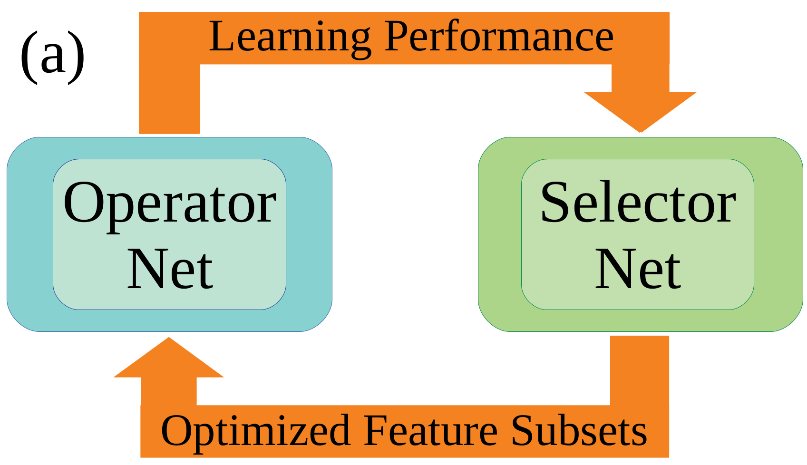
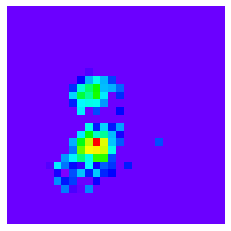
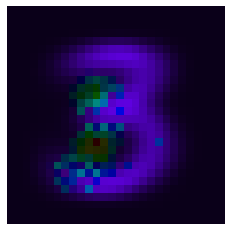
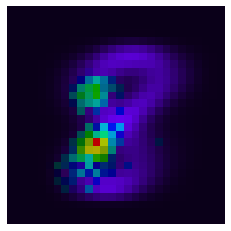

# FeatureImportanceDL
Contains example of a deep-learning based dual-net feature selection method from https://arxiv.org/abs/2010.08973 :


This is an embedded method for supervised tasks: after training, it is able to give predictions (better then vanilla architecture) while also return population-wise (global) feature importances.

See ```example.py``` script that shows how the method works for a basic XOR dataset.
Some examples for MNIST dataset (digit 3 & 8 differentiation):






